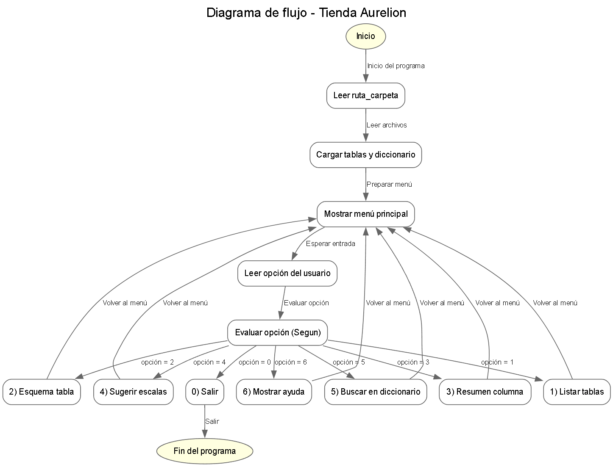

**Pasos**

A continuación se muestran los pasos para el desarrollo de un programa en Python que permita cumplir con la solución al problema de la base de datos de la tienda Aurelion.

Entrada: pedir ruta_carpeta donde están clientes.xlsx, productos.xlsx, ventas.xlsx, detalle_ventas.xlsx (y opcional diccionario.xlsx o .csv).

Carga:
*Detectar y leer Excel/CSV válidos.

*Validar columnas mínimas por tabla.

*Unificar nombres de columnas (minúsculas, sin tildes, sin espacios).

Preparación:

*Crear un diccionario en memoria {nombre_tabla → dataframe}.

*Índices y llaves (PK/FK) opcionales para validaciones rápidas.

Menú interactivo:

*Listar tablas (nombre, filas, columnas).

*Esquema (columnas + tipo inferido).

*Resumen (nulos, únicos y estadísticos/top).

Escalas sugeridas por columna (nominal, ordinal, intervalo, razón).

Buscar en diccionario (palabra clave).

Ayuda.

Salir.

Salida: imprimir resultados de cada opción y permitir volver al menú.

**Pseudocódigo**
// ============================================
// TIENDA AURELION - CONSULTOR DE DOCUMENTACION
// ============================================

Proceso Aurelion_Consultor
    // ---- Variables globales ----
    Definir ruta_carpeta, nombre_tabla, t, c, t2, q, op_str, ch Como Cadena
    Definir opcion, cargado_clientes, cargado_productos, cargado_ventas, cargado_detalle Como Entero
    Definir hay_dicc, esnum Como Logico
    Definir i, n, dig, temp_num Como Entero

    // 1) Entrada de ruta
    Escribir "Ingrese la ruta de la carpeta con los archivos (Excel/CSV):"
    Leer ruta_carpeta

    // 2) Carga simulada (sin parámetros)
    Llamar cargar_clientes()
    Llamar cargar_productos()
    Llamar cargar_ventas()
    Llamar cargar_detalle_ventas()
    Llamar cargar_diccionario()

    // 3) Bucle principal
    Repetir
        Llamar mostrar_menu()
        Llamar leer_opcion()

        Segun opcion Hacer
            1:
                Llamar listar_tablas()
            2:
                Escribir "Nombre de la tabla para ver esquema (clientes/productos/ventas/detalle_ventas):"
                Leer nombre_tabla
                Llamar esquema_tabla()
            3:
                Escribir "Tabla para resumen (clientes/productos/ventas/detalle_ventas):"
                Leer t
                Escribir "Columna para resumen (ej: precio_unitario, categoria, ciudad, importe, etc.):"
                Leer c
                Llamar resumen_columna()
            4:
                Escribir "Tabla para sugerir escalas (clientes/productos/ventas/detalle_ventas) o 'todas':"
                Leer t2
                Llamar sugerir_escalas()
            5:
                Si hay_dicc = Falso Entonces
                    Escribir "No hay diccionario cargado."
                SiNo
                    Escribir "Texto a buscar en el diccionario:"
                    Leer q
                    Llamar buscar_dicc()
                FinSi
            6:
                Llamar mostrar_ayuda()
            0:
                Escribir "Saliendo... ¡gracias!"
            De Otro Modo:
                Escribir "Opcion invalida."
        FinSegun
    Hasta Que opcion = 0
FinProceso

// =============================
// CARGA 
// =============================
SubProceso cargar_clientes()
    Si Longitud(ruta_carpeta) > 0 Entonces
        Escribir "Intentando cargar: clientes desde ", ruta_carpeta
        cargado_clientes <- 1
    SiNo
        cargado_clientes <- 0
    FinSi
FinSubProceso

SubProceso cargar_productos()
    Si Longitud(ruta_carpeta) > 0 Entonces
        Escribir "Intentando cargar: productos desde ", ruta_carpeta
        cargado_productos <- 1
    SiNo
        cargado_productos <- 0
    FinSi
FinSubProceso

SubProceso cargar_ventas()
    Si Longitud(ruta_carpeta) > 0 Entonces
        Escribir "Intentando cargar: ventas desde ", ruta_carpeta
        cargado_ventas <- 1
    SiNo
        cargado_ventas <- 0
    FinSi
FinSubProceso

SubProceso cargar_detalle_ventas()
    Si Longitud(ruta_carpeta) > 0 Entonces
        Escribir "Intentando cargar: detalle_ventas desde ", ruta_carpeta
        cargado_detalle <- 1
    SiNo
        cargado_detalle <- 0
    FinSi
FinSubProceso

SubProceso cargar_diccionario()
    Si Longitud(ruta_carpeta) > 0 Entonces
        Escribir "Buscando diccionario en ", ruta_carpeta
        hay_dicc <- Verdadero
    SiNo
        hay_dicc <- Falso
    FinSi
FinSubProceso

// =============================
// MENÚ Y ENTRADA
// =============================
SubProceso mostrar_menu()
    Escribir ""
    Escribir "===== MENU AURELION ====="
    Escribir "1) Listar tablas (nombre y dimensiones)"
    Escribir "2) Esquema (columnas + tipo inferido)"
    Escribir "3) Resumen (nulos, unicos, stats/top)"
    Escribir "4) Escalas sugeridas por columna"
    Escribir "5) Buscar en diccionario (opcional)"
    Escribir "6) Ayuda"
    Escribir "0) Salir"
FinSubProceso

SubProceso leer_opcion()
    Escribir "Elija opcion:"
    Leer op_str

    // validar que op_str sea numerico
    esnum <- Verdadero
    n <- Longitud(op_str)
    Si n = 0 Entonces
        esnum <- Falso
    SiNo
        Para i <- 1 Hasta n Con Paso 1 Hacer
            ch <- SubCadena(op_str, i, 1)
            Si ch < "0" O ch > "9" Entonces
                esnum <- Falso
            FinSi
        FinPara
    FinSi

    // convertir a numero si es valido
    Si esnum = Verdadero Entonces
        temp_num <- 0
        Para i <- 1 Hasta n Con Paso 1 Hacer
            ch <- SubCadena(op_str, i, 1)
            Segun ch Hacer
                "0": dig <- 0
                "1": dig <- 1
                "2": dig <- 2
                "3": dig <- 3
                "4": dig <- 4
                "5": dig <- 5
                "6": dig <- 6
                "7": dig <- 7
                "8": dig <- 8
                "9": dig <- 9
                De Otro Modo:
                    dig <- 0
            FinSegun
            temp_num <- temp_num * 10 + dig
        FinPara
        opcion <- temp_num
    SiNo
        opcion <- -1
    FinSi
FinSubProceso

// =============================
// ACCIONES
// =============================
SubProceso listar_tablas()
    Si cargado_clientes = 1 Entonces
        Escribir "- clientes: 100 filas x 5 columnas"
    SiNo
        Escribir "- clientes: (no cargada)"
    FinSi

    Si cargado_productos = 1 Entonces
        Escribir "- productos: 100 filas x 4 columnas"
    SiNo
        Escribir "- productos: (no cargada)"
    FinSi

    Si cargado_ventas = 1 Entonces
        Escribir "- ventas: 120 filas x 4 columnas"
    SiNo
        Escribir "- ventas: (no cargada)"
    FinSi

    Si cargado_detalle = 1 Entonces
        Escribir "- detalle_ventas: 343 filas x 6 columnas"
    SiNo
        Escribir "- detalle_ventas: (no cargada)"
    FinSi
FinSubProceso

SubProceso esquema_tabla()
    Escribir "Esquema de ", nombre_tabla, ":"
    Si nombre_tabla = "clientes" Entonces
        Escribir "  - id_cliente -> numerico (PK)"
        Escribir "  - nombre_cliente -> texto"
        Escribir "  - email -> texto"
        Escribir "  - ciudad -> texto"
        Escribir "  - fecha_alta -> fecha"
    SiNo
        Si nombre_tabla = "productos" Entonces
            Escribir "  - id_producto -> numerico (PK)"
            Escribir "  - nombre_producto -> texto"
            Escribir "  - categoria -> texto"
            Escribir "  - precio_unitario -> numerico"
        SiNo
            Si nombre_tabla = "ventas" Entonces
                Escribir "  - id_venta -> numerico (PK)"
                Escribir "  - fecha -> fecha"
                Escribir "  - id_cliente -> numerico (FK)"
                Escribir "  - medio_pago -> texto"
            SiNo
                Si nombre_tabla = "detalle_ventas" Entonces
                    Escribir "  - id_venta -> numerico (FK)"
                    Escribir "  - id_producto -> numerico (FK)"
                    Escribir "  - nombre_producto -> texto"
                    Escribir "  - cantidad -> numerico"
                    Escribir "  - precio_unitario -> numerico"
                    Escribir "  - importe -> numerico"
                SiNo
                    Escribir "Tabla no reconocida."
                FinSi
            FinSi
        FinSi
    FinSi
FinSubProceso

SubProceso resumen_columna()
    Escribir "Resumen de ", t, ".", c
    Escribir " - Filas: (simulado)"
    Escribir " - Nulos: (simulado)"
    Escribir " - Valores unicos: (simulado)"
    Si c = "precio_unitario" O c = "importe" O c = "cantidad" Entonces
        Escribir " - Min: (sim)"
        Escribir " - Max: (sim)"
        Escribir " - Media: (sim)  P50: (sim)  Desv: (sim)"
    SiNo
        Escribir " - Top 5 categorias: (sim)"
    FinSi
FinSubProceso

SubProceso sugerir_escalas()
    Si t2 = "todas" Entonces
        Escribir "Tabla: clientes"
        nombre_tabla <- "clientes"
        Llamar sugerir_escalas_una()
        Escribir "Tabla: productos"
        nombre_tabla <- "productos"
        Llamar sugerir_escalas_una()
        Escribir "Tabla: ventas"
        nombre_tabla <- "ventas"
        Llamar sugerir_escalas_una()
        Escribir "Tabla: detalle_ventas"
        nombre_tabla <- "detalle_ventas"
        Llamar sugerir_escalas_una()
    SiNo
        nombre_tabla <- t2
        Llamar sugerir_escalas_una()
    FinSi
FinSubProceso

SubProceso sugerir_escalas_una()
    Escribir "Sugerencias de escalas para ", nombre_tabla, ":"
    Si nombre_tabla = "clientes" Entonces
        Escribir "  - id_cliente -> nominal (ID)"
        Escribir "  - nombre_cliente -> nominal"
        Escribir "  - email -> nominal"
        Escribir "  - ciudad -> nominal"
        Escribir "  - fecha_alta -> ordinal (fecha)"
    SiNo
        Si nombre_tabla = "productos" Entonces
            Escribir "  - id_producto -> nominal (ID)"
            Escribir "  - nombre_producto -> nominal"
            Escribir "  - categoria -> nominal"
            Escribir "  - precio_unitario -> razon"
        SiNo
            Si nombre_tabla = "ventas" Entonces
                Escribir "  - id_venta -> nominal (ID)"
                Escribir "  - fecha -> ordinal (fecha)"
                Escribir "  - id_cliente -> nominal (FK)"
                Escribir "  - medio_pago -> nominal/ordinal (segun orden definido)"
            SiNo
                Si nombre_tabla = "detalle_ventas" Entonces
                    Escribir "  - id_venta -> nominal (FK)"
                    Escribir "  - id_producto -> nominal (FK)"
                    Escribir "  - nombre_producto -> nominal"
                    Escribir "  - cantidad -> razon"
                    Escribir "  - precio_unitario -> razon"
                    Escribir "  - importe -> razon"
                SiNo
                    Escribir "Tabla no reconocida."
                FinSi
            FinSi
        FinSi
    FinSi
FinSubProceso

SubProceso buscar_dicc()
    Escribir "Buscar en diccionario: ", q
    Escribir "Coincidencias (simulado):"
    Escribir " - (sim) termino: ", q, " -> descripcion ejemplo"
FinSubProceso

SubProceso mostrar_ayuda()
    Escribir "Ayuda rapida:"
    Escribir " 1) Listar: nombres y dimensiones."
    Escribir " 2) Esquema: columnas + tipo inferido."
    Escribir " 3) Resumen: nulos, unicos y stats/top."
    Escribir " 4) Escalas: nominal/ordinal/intervalo/razon por columna."
    Escribir " 5) Diccionario: buscar terminos (si existe)."
    Escribir " 0) Salir."
FinSubProceso

**Diagrama de Flujo***

